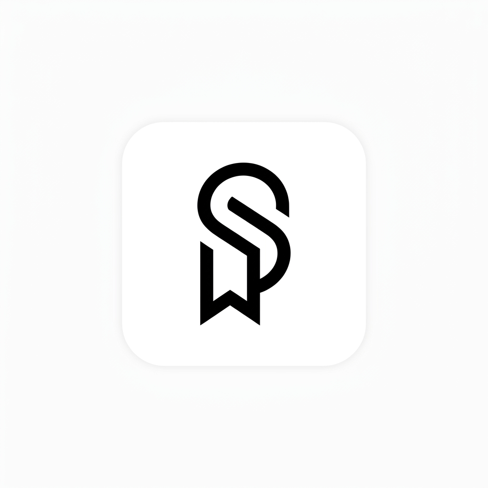

<div align="center">
  

  # SaveIt

  **Save instantly. Search locally. Stay private.**
</div>

<br />

SaveIt is a fast, local-first, and completely private digital vault for Android. Easily bookmark links and capture notes, then use the built-in AI assistant to organize, search, and chat with your saved data. 

## ✨ Features

- **⚡ Quick & Intuitive**: Instantly save links and notes with a beautiful, modern Material Design 3 interface built on Jetpack Compose.
- **🔒 Local & Private**: All your data is stored securely offline on your device. You are in full control of your digital vault.
- **🤖 AI-Powered Chat**: A fully featured, multi-threaded messaging interface to chat with your saved data. The AI can intelligently search your items and answer context-aware questions.
- **📂 Advanced Grouping**: Easily select multiple items, create custom groups, or add them to existing ones to keep your digital life organized.
- **⚙️ Flexible AI Integration**: Plug in your own API keys for Google Gemini or OpenAI, or use the free, built-in Pollinations AI option. 

## 📸 Screenshots

<!-- Add your screenshots here. Replace the paths below with your actual images -->
| Home Screen | AI Chat | Grouping | Settings |
|:---:|:---:|:---:|:---:|
|  |  |  |  |

## 🛠️ Development Setup

Follow these steps to set up the project locally:

### Prerequisites
- [Android Studio](https://developer.android.com/studio) (Koala or newer recommended)
- JDK 17 or higher
- Android SDK (API 34/35)

### Building the Project
1. **Clone the repository:**
   ```bash
   git clone https://github.com/yourusername/SaveIt.git
   cd SaveIt
   ```

2. **Open in Android Studio:**
   - Launch Android Studio.
   - Select **File > Open** and choose the `SaveIt` project directory.
   - Allow Gradle to sync the dependencies.

3. **Build and Run:**
   - Connect an Android device or start an emulator.
   - Click the ▶️ **Run** button in Android Studio, or run the following command in the terminal:
     ```bash
     ./gradlew assembleDebug
     ./gradlew installDebug
     ```

### Architecture & Tech Stack
- **Language**: Kotlin
- **UI Framework**: Jetpack Compose
- **Architecture**: MVVM (Model-View-ViewModel)
- **Serialization**: `kotlinx.serialization`
- **Network**: Built-in HTTP stack for AI API integrations

## 🤝 Contributing

Contributions are welcome! Feel free to open issues or submit pull requests.

## 📄 License

This project is licensed under the [MIT License](LICENSE).
